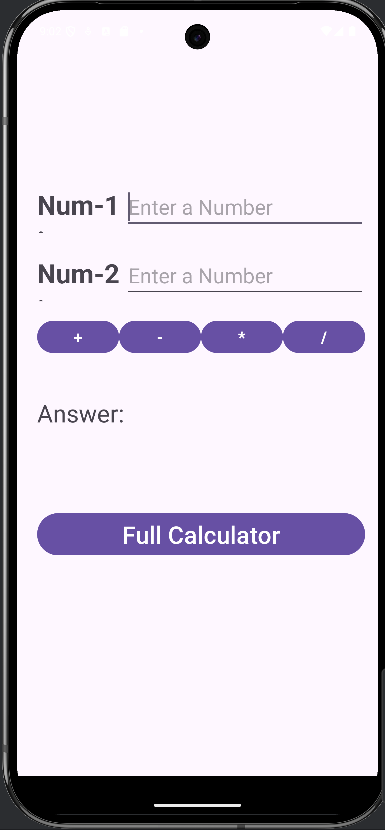
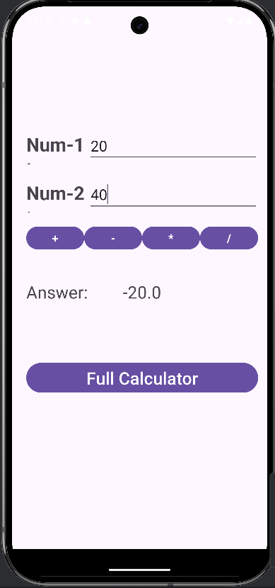
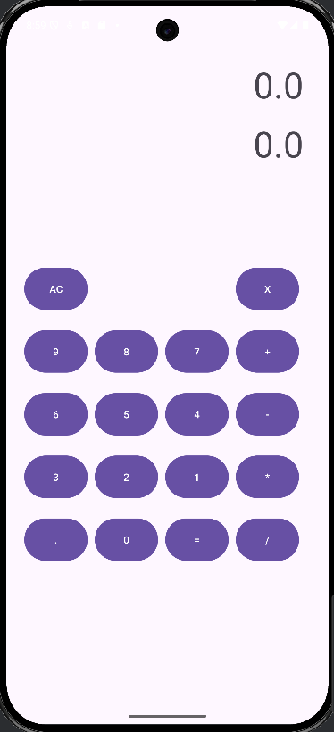
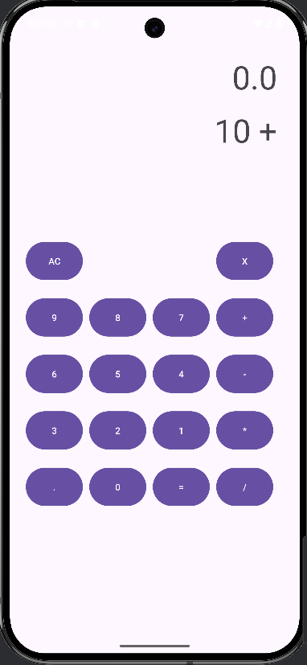
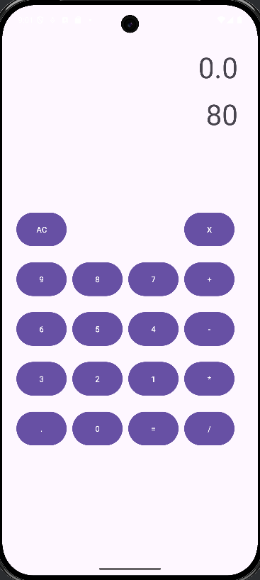
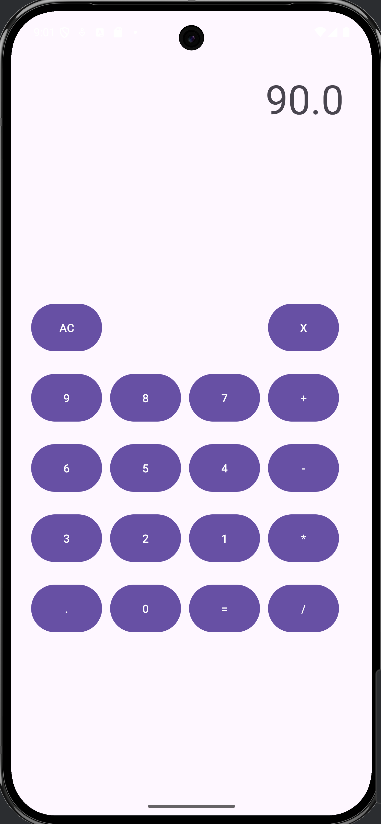

# Basic Calculator App

This is a beginner-friendly Android application developed using Kotlin and XML in Android Studio. The app allows users to perform basic arithmetic operations such as:

- Addition (+)
- Subtraction (-)
- Multiplication (×)
- Division (÷)

## Features

- Simple and intuitive UI
- Input validation
- Instant results
- Lightweight and fast
## ScreenShots

## Getting Started

To run this project:

1. Clone the repository
2. Open it in Android Studio
3. Build and run on an emulator or physical device

## Technologies Used

- Kotlin
- XML Layouts
- Android Studio

---
